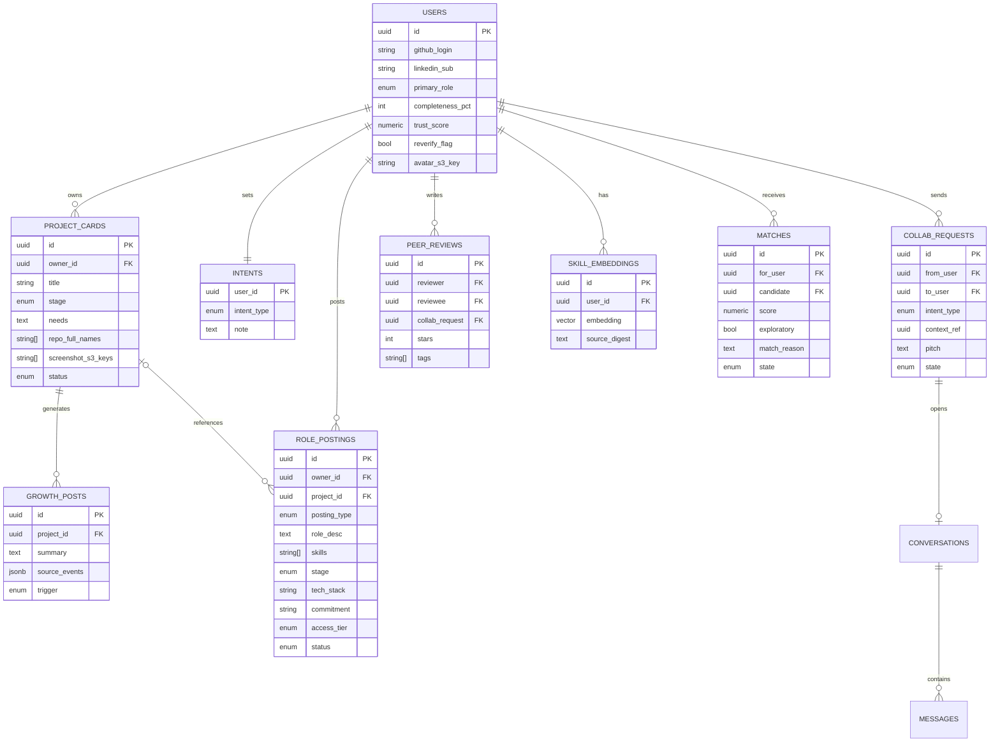

# Builder Plaza — Product Requirements Document (PRD)
---

## 1. 概述与目标

### 1.1 产品定位

Builder Plaza 是一款 Flutter 跨平台移动应用(iOS + Android,单一代码库),把当前分裂在 GitHub(工作证明)、LinkedIn(职业身份)、Discord/Product Hunt(微弱的可用性信号)中的协作信任,统一为一个结构化层:**已验证的工作证明 + 职业身份 + 当前协作意向 + 安全的情境化联络**。

产品回答的核心问题(源自生成式研究的五位参与者):
> "这个人可信吗?他现在开放协作吗?在这个具体情境下联系他安全吗?"

### 1.2 范围声明(必读)

- 本 PRD 覆盖 **CT124-3-2-MAE Part 2 交付物**:可演示的 Flutter 应用 + 报告 + 自动化测试 + 演示视频。
- Proposal 与研究文档中提到的**每一个功能都会出现在应用中**,但按 **Live / Mocked 两档实现深度**分层(定义见 `CONTEXT.md`)。该分层不是妥协,而是评分策略:作业要求明确允许"无法完整实现的业务逻辑以 mock-up 屏幕支撑",且 Distinction 档明确奖励"functionalities 与 mock-ups 的出色组合"。
- 每个 Mocked 功能在 UI、演示与报告中**明确标注为模拟**,绝不伪装为真实集成(学术诚信红线,见 ADR-0003)。

### 1.3 成功标准

1. 应用在 iOS 与 Android 上编译、运行、无错误(评分 Credit 档底线)。
2. 三个用户角色各有完整可走通的核心动线(注册→核心操作→闭环)。
3. 全部 Mocked 功能有清晰的模拟边界标注。

---

## 2. 用户与角色

### 2.1 三个角色

| 角色 | 定义 | 核心动机(源自研究) |
|---|---|---|
| **Builder** | 正在造产品并发布进展的人。拥有 Project Card,发布 Growth Plaza 动态与维护职位(Role Posting)| "冷 DM 低效、当前意向不可见"(P1);"star 换不来维护人手"(P2);"AI 项目噪音大"(P4) |
| **Collaborator** | 想加入或贡献项目的人 | "GitHub 是黑盒"(P3)——需要白话可信度摘要与 Match Reason |
| **Founder** | 招聘或筛选人才的人(Recruiter / Founder / Project Owner 的统一命名) | "CV 注水、信号碎片化,短名单成本高"(P5) |

### 2.2 单账号 + Primary Role 可切换模型(已确认)

- `users.primary_role ∈ {builder, collaborator, founder}`,注册最后一步选择,设置页可随时切换。
- 角色是**视图偏好**,不是身份或权限边界:切换只更换底部导航 shell 与首页,所有数据挂在同一 `user_id` 下不变。
- 身份由 Dual-Source Trust Gateway 唯一确立,与角色无关。
- 共用页面(Project Card 详情、个人主页、会话页)三视图只实现一份。

### 2.3 角色 ↔ 研究 persona 映射(种子数据依据)

| 应用角色 | 研究 persona |
|---|---|
| Builder | P1 Ryan Tan(indie builder)、P2 Aisha Rahman(OSS maintainer)、P4 Daniel Wong(agent-native builder) |
| Collaborator | P3 Mei Chen(非技术产品设计师)、R1–R3 |
| Founder | P5 Marcus Lee(startup CTO)、S1–S3 |

### 2.4 用例 ↔ 模块追溯表(完整性总览)

| # | 角色用例 | 承载模块 | 层级 |
|---|---|---|---|
| A1 | 注册与双源验证 | F1 | Live(LinkedIn 双实现) |
| A2 | 创建与管理项目卡片(含 Demo 链接、成员分工) | F3 | Live |
| A3 | 设定意图与可用状态 | F3 | Live |
| A4 | 发布项目动态/进度帖 | F4 | Live(轮询替代 Webhooks,ADR-0002) |
| A5 | 发布维护者招募 | F8 | Live |
| A6 | 发送受控协作请求 | F7 | Live |
| A7 | 沙箱试运行 | F9 | Mocked |
| A8 | 查看已验证活动时间线 | F10 | Live |
| A9 | 请求 AI 短名单(Builder 入口) | F9 | Mocked |
| B1 | 浏览项目广场 / 发现 | F4 + F5 | Live |
| B2 | 查看大白话信誉总结 | F5 | Live |
| B3 | 查看系统匹配原因(Match Reason) | F5 | Live |
| B4 | 发起上下文相关的接触 | F7 | Live |
| C1 | 发布结构化岗位请求 | F8(team_role) | Live |
| C2 | 获取 AI 智能初筛名单 | F9 | Mocked |
| C3 | 查看项目所有权证据 | F10 + F6 | Live |
| C4 | 最终触达控制(human-approve) | F9 + F7 | 交互 Live / 候选数据 Mocked |

---

## 3. 功能需求

每个模块统一格式:**层级(Live/Mocked)· 负责人 · 用户故事 · 验收标准**。负责人对应第 9 节垂直切片。

### F1 Dual-Source Trust Gateway

**层级:** GitHub = Live;LinkedIn = Live 双实现(`LinkedInLive` / `LinkedInSimulated`,环境变量切换,见 ADR-0003)
**负责人:** Liu Wei(流程)+ Choong Ti Huai(Trust 数据消费)

**用户故事:** 作为任意新用户,我必须先完成 GitHub OAuth 与 LinkedIn 身份绑定,才能创建档案,以此保证广场里没有未经验证的账号。

**验收标准:**
- [ ] 未完成双源绑定的用户无法进入除注册流以外的任何页面。
- [ ] GitHub OAuth 成功后,后端拉取:公开仓库列表、语言分布、近 90 天 commit/PR 活动、仓库 topics。
- [ ] LinkedIn 绑定走 `IdentityProvider` 接口;Simulated 实现呈现带 "Simulated for demo" 水印的仿真授权屏,提供 3–5 个预置职业档案,返回与真实 OIDC 相同结构的数据。
- [ ] Flutter 端无法区分(也无需区分)当前是哪个 LinkedIn 实现。
- [ ] 绑定失败/中断可安全重试,不产生半成品账号。

### F2 Profile 与完整度门控

**层级:** Live
**负责人:** Liu Wei

**用户故事:** 作为用户,我的档案完整度决定我的曝光:低于 40% 在广场隐藏,达到 70% 解锁完整匹配——平台以此平衡曝光与隐私,并保证匹配质量。

**验收标准:**
- [ ] 完整度按字段权重实时计算并在编辑页可视化(进度环 + 缺项提示)。
- [ ] `<40%`:不出现在发现流与匹配结果;`40–69%`:出现但标注受限;`≥70%`:完整匹配。
- [ ] GitHub 活动异常波动(如 star 数短期激增)触发信任分临时降权并提示重新验证(检测规则可以是简单阈值,Live;详见 F6)。
- [ ] 头像上传走 S3 预签名 URL,存储的是匿名化头像(评分项:image-based binary data)。

### F3 Project Card 与 Intent Badge

**层级:** Live(核心 CRUD)
**负责人:** Liu Wei

**用户故事:** 作为 Builder,我为每个进行中的产品创建一张 Project Card(描述、阶段、当前需求、截图),并用 Intent Badge 声明"我现在开放什么"(找联创/找维护者/只交流/暂不开放),让意向成为一等公民字段。

**验收标准:**
- [ ] Project Card 完整 CRUD:创建、浏览/发现、更新阶段与需求、归档。
- [ ] 卡片可关联 1–N 个已验证 GitHub 仓库,展示真实活动摘要(非自述)。
- [ ] 卡片字段包含 Demo 链接(`demo_url`)与成员分工说明(`team_division`)。
- [ ] 项目截图上传 S3,卡片内画廊展示。
- [ ] Intent Badge 完整 CRUD:设置、展示于个人页与卡片、修改、清除;所有角色可用。
- [ ] 表单有输入校验(评分 Credit 档要求 validations)。

### F4 Growth Plaza

**层级:** Live(GitHub 轮询 + Bedrock 摘要)
**负责人:** Liu Wei

**用户故事:** 作为 Builder,我不写营销文案——平台把我的真实代码活动(commit / PR / release)自动提炼成"产品成长"卡片发进广场;"Build = Publish"。

**验收标准:**
- [ ] 后端按项目轮询 GitHub REST API 拉取增量活动(不使用 Webhook,ADR-0002)。
- [ ] Bedrock(Claude Haiku)把活动批次摘要为一张中性、白话的 growth 卡片;prompt 固化在代码库中。
- [ ] 双触发:项目详情页"刷新动态"按钮(演示可控)+ EventBridge 每日定时(证明自动化真实存在)。
- [ ] 广场流按时间倒序,支持按角色/技术栈过滤;卡片点击进入 Project Card。
- [ ] LLM 不可用时优雅降级为模板化摘要(纯字符串拼接),UI 无感。

### F5 发现与匹配引擎

**层级:** Live(全管线,见 ADR-0001)
**负责人:** Gao Xing(展示与发现)+ Choong Ti Huai(引擎)

**用户故事:** 作为 Collaborator 或 Founder,我得到**少而好、每条都有理由**的匹配,而不是刷卡式海量推荐;作为 Builder,我的技能画像来自真实代码而非自述。

**管线(固定):**
1. **画像嵌入:** sentence-transformers `all-MiniLM-L6-v2` 将两类文本嵌入为 384 维向量:(a) Builder 技能文本 = GitHub 仓库 topics + 语言 + README 摘录;(b) 需求文本 = Project Card 需求 + Intent + Founder 搜索意图。存入 pgvector。
2. **召回:** pgvector 余弦相似度取 top-k(k=20)。
3. **打分:** scikit-learn `GaussianProcessRegressor` 在嵌入衍生特征上,基于少量人工标注的示例匹配对训练,输出匹配分(GP 适合几十条样本的小数据场景——与种子规模一致)。
4. **探索:** epsilon-greedy,ε=0.2:结果列表 80% 按分数、20% 随机注入跨领域候选。
5. **Match Reason:** 从双方嵌入源文本中提取 top 重叠技能词条,模板生成一句白话理由(如 "你们都深耕 Flutter 与 PostgreSQL,对方项目正需要移动端合作者")。

**验收标准:**
- [ ] 每条匹配结果必须携带 Match Reason,无理由不展示(设计原则:explainability)。
- [ ] 匹配列表可刷新;刷新后 20% 探索位可见变化。
- [ ] 对 P3 类非技术用户,同一证据自动渲染为**白话可信度摘要**(role-adaptive translation):不展示 commit 图,展示"过去三个月持续开发、有 X 位真实贡献者"式语句。
- [ ] 引擎有 pytest 单测:固定种子嵌入下断言 top-k 稳定、Match Reason 非空。
- [ ] 报告与 UI 中对该引擎的称谓统一为 "embedding-based retrieval with Gaussian-process scoring"。

### F6 Trust Score Engine

**层级:** Live 复合分(GitHub 指数 + LinkedIn tenure + 同侪评审);Stripe 分量 = Mocked 徽章
**负责人:** Choong Ti Huai

**用户故事:** 作为 Founder,我看到每个候选人的复合信任分及其**成分拆解**,把 GPT 包装的中间商和刷量账号挡在外面。

**评分构成(权重固化在配置中,报告需说明):**
| 分量 | 来源 | 层级 |
|---|---|---|
| GitHub 贡献指数 | commit 频率、仓库年龄、PR 合并率、原创性(fork 占比)——不使用裸 star 数 | Live |
| LinkedIn tenure | IdentityProvider 返回的任职时长 | Live(数据可来自 Simulated) |
| 同侪评审 | 平台内协作后的互评(1–5 星 + 标签),完整 CRUD | Live |
| Stripe 收入徽章 | 固定展示位 + "Verification simulated" 标注 | **Mocked** |

**验收标准:**
- [ ] 分数页可展开查看每个分量的贡献与解释。
- [ ] 异常波动降权(F2)反映到展示权重,并显示"待重新验证"状态。
- [ ] 同侪评审仅在一次协作请求被双方完成后解锁(防刷)。

### F7 Controlled DM 与 Collaboration Request

**层级:** Live;实时性 = 10 秒轮询(不上 WebSocket,预留升级接口)
**负责人:** Gao Xing

**用户故事:** 作为任意用户,我不能向陌生人发裸私信——联络必须以**结构化协作请求**发起(意图类型 + 关联 Project Card / Role Posting + 一段说明),对方接受后才开启会话;平台不暴露任何原始联系方式。

**验收标准:**
- [ ] 请求完整 CRUD:发送、收件箱查看、接受/拒绝、撤回。
- [ ] 接受前双方无法自由发消息;拒绝后同一发起方对同一目标有冷却限制。
- [ ] 会话页 10 秒轮询;消息持久化于 PostgreSQL。
- [ ] Founder 视图的发起入口是"结构化协作请求"表单(带职位/项目上下文必填项)。
- [ ] 任何页面不渲染邮箱、电话或外部社交账号原文。

### F8 Request Market(统一职位市场)

**层级:** Live(CRUD)
**负责人:** Liu Wei(维护职位发布侧)+ Choong Ti Huai(团队招募发布侧)+ Gao Xing(市场浏览/申请侧)

**用户故事:** 一张 `role_postings` 表承载两类发布(`posting_type ∈ {maintainer, team_role}`):作为 maintainer 身份的 Builder,我发布具体的维护职位(仓库、职责、所需技能、访问分级),走 claim-an-issue → limited → full 的分级信任阶梯(v1 表达为职位字段与状态标签);作为 Founder,我发布结构化团队招募卡,**项目阶段、技术栈、时间周期为必填字段**。Collaborator 在同一个市场页浏览并申请两类职位。

**验收标准:**
- [ ] 职位完整 CRUD:发布、市场浏览(按 posting_type 与技能过滤)、编辑/关闭、删除。
- [ ] team_role 发布表单强制校验阶段/技术栈/周期三个必填项;maintainer 发布必须关联已验证仓库并指定 access_tier。
- [ ] 申请动作复用 F7 的结构化请求管道。
- [ ] 职位卡展示关联仓库/项目的真实活动摘要(复用 F4 数据)。

### F9 Mocked 套件(全部为真实 UI + 模拟数据,统一带 "Simulated" 标注)

**负责人:** Gao Xing(UI)+ Choong Ti Huai(模拟数据设计)

| 功能 | UI 行为 | 模拟边界 |
|---|---|---|
| **WASM 安全沙箱** | Project Card 上"Run Safe Demo"按钮 → 沙箱屏:资源限制说明、模拟执行日志逐行滚动、退出即销毁的提示 | 不执行任何真实代码;日志为预置脚本 |
| **AI Shortlist(human-approved)** | Founder 与 Builder 视图均有"请求 AI 短名单"入口(Founder 找人才,Builder 找协作者)→ 展示候选列表 + 每人一句理由 + 逐条"批准/驳回"开关,批准后才进入正式短名单 | 候选与理由为预置数据;human-in-the-loop 交互是真实的 |
| **MCP / A2A 代理接入** | 设置页"Agent Access"面板:接入开关、权限范围勾选、已连接代理列表 | 无真实 MCP 端点;开关状态持久化但不生效于任何外部系统 |
| **Proof-of-Work 挑战** | 代理接入开关打开时弹出挑战屏(题目 + 倒计时 + 通过动画) | 挑战结果预置为通过 |
| **Stripe 收入徽章** | Trust Score 页与个人页的徽章位 + "如何验证收入"说明页 | 徽章数据硬编码;标注 "Verification simulated" |

**验收标准(套件通用):**
- [ ] 每个 Mocked 屏幕右上角有统一的 "Simulated" 徽标组件(一处实现,处处复用)。
- [ ] 用户手册与报告的对应章节逐项声明模拟边界。

### F10 Verified Activity Timeline 与 Ownership Evidence

**层级:** Live(数据全部来自 F1/F4 已入库的 GitHub 事件,零新增外部依赖)
**负责人:** Choong Ti Huai

**用户故事:** 作为任意用户,我的个人主页有一个 "Verified Activity" 标签页,按时间渲染我已验证的 GitHub 活动(commit / PR / release),让"证据先于自述"落到可见界面;作为 Founder,我在候选人 Trust Score 页的 "Ownership Evidence" 标签中审查其 commit 连续性与仓库角色,判断项目是否真的属于他。

**验收标准:**
- [ ] 个人主页 Verified Activity 标签:事件按时间倒序,类型图标区分 commit/PR/release,来源仓库可点击。
- [ ] Trust Score 页 Ownership Evidence 标签:commit 连续性图表(fl_chart 折线/热力)+ 关联仓库角色列表(owner / contributor,取自 GitHub API 真实字段)。
- [ ] 两个视图不含任何自述内容;数据为空时明确显示"暂无已验证活动",不用占位假数据。

---

## 4. 非功能需求

| # | 需求 | 具体约束 |
|---|---|---|
| NFR-1 | **LinkedIn API 合规** | 仅使用 Sign-In-with-LinkedIn(OIDC);会员数据即时渲染、缓存 ≤48 小时;持久化的只有去隐私化技能嵌入;不做任何自动化 LinkedIn 消息 |
| NFR-2 | **隐私与匿名** | 档案头像匿名化;不暴露原始联系方式(F7);去隐私化嵌入不可逆推原文 |
| NFR-3 | **最小权限与分级访问** | claim-an-issue → limited → full 的信任阶梯;不可信代码只存在于沙箱叙事内(v1 为 Mocked) |
| NFR-4 | **可解释性** | 任何推荐(匹配、短名单)必须携带人类可读理由 |
| NFR-5 | **跨平台一致性** | 单一 Flutter 代码库;iOS/Android 均通过全部 integration_test;Mobile Adaptive Design(不同屏幕尺寸自适应) |
| NFR-6 | **弱网容忍(只读)** | 广场流、Project Card、个人页做本地缓存,断网可读;写操作要求在线并给出明确错误 |
| NFR-7 | **纯云、纯 AWS** | 不存在本地部署路径;所有环境(dev/demo)均在 AWS(团队决定,见 ADR-0002) |
| NFR-8 | **禁用 No-Code/Low-Code** | 不使用 FlutterFlow 等平台(作业规则:使用即失去 Distinction 资格) |

---

## 5. 系统架构

### 5.1 AWS 服务映射(ADR-0002)

```
Flutter (iOS / Android)
        │  HTTPS / REST (JSON)
        ▼
┌─────────────────────────────────────────────┐
│  Application Load Balancer(HTTPS 终止)       │
└──────┬────────────────────────────────────────┘
       ▼
┌─────────────────────────────────────────────┐
│  AWS ECS Fargate — 单容器 FastAPI (Python)   │
│  ├─ Auth (GitHub OAuth · IdentityProvider)  │
│  ├─ Trust Gateway & Trust Score Engine      │
│  ├─ Growth Plaza Service (GitHub 轮询)       │
│  ├─ Matching Engine (SBERT + GPR + ε-greedy)│
│  └─ Messaging & Request Service             │
└──────┬───────────────┬──────────────┬───────┘
       ▼               ▼              ▼
 RDS PostgreSQL      S3          Amazon Bedrock
 (+ pgvector:       (头像 ·      (Claude Haiku:
  结构化数据 +       项目截图,     growth 卡片摘要)
  技能嵌入)          预签名 URL)
       ▲
 EventBridge (每日定时触发 Growth Plaza 轮询)
```

- 计算:原选型为 App Runner,因 AWS 已停止向新账号开放 App Runner 访问权限,已于 2026-07-14 改为 **ECS Fargate**(单任务、desired count = 1,不做自动伸缩,匹配演示规模)+ **Application Load Balancer** 承担 HTTPS 终止与健康检查;容器镜像存放于 **ECR**(详见 ADR-0002 amendment)。
- 认证:GitHub-OAuth 为根的自建 JWT;不使用 Cognito。
- 密钥:全部走 AWS 环境配置(ECS 任务定义 env / Secrets Manager),严禁入 git。

### 5.2 REST API 一览(v1)

| 资源 | 端点族 | 说明 |
|---|---|---|
| Auth | `POST /auth/github`, `GET /auth/github/callback`, `POST /auth/linkedin`, `GET /auth/linkedin/callback`, `POST /auth/refresh` | LinkedIn 端点由 IdentityProvider 实现分发 |
| Profile | `GET/PATCH /me`, `GET /users/{id}`, `POST /me/avatar-upload-url`, `POST /me/role` | role 切换即 PATCH primary_role |
| Project Card | `GET/POST /projects`, `GET/PATCH/DELETE /projects/{id}`, `POST /projects/{id}/screenshots-upload-url`, `POST /projects/{id}/refresh-growth` | refresh-growth = F4 手动触发 |
| Intent | `GET/PUT/DELETE /me/intent` | |
| Plaza | `GET /plaza?filter=…` | 分页时间流 |
| Matching | `GET /matches`, `POST /matches/{id}/dismiss`, `GET /users/{id}/credibility-summary` | summary 按请求方角色渲染白话版 |
| Requests | `GET/POST /requests`, `POST /requests/{id}/accept|decline|withdraw` | |
| Messages | `GET/POST /conversations/{id}/messages`(客户端 10s 轮询) | |
| Request Market | `GET/POST /role-postings`, `PATCH/DELETE /role-postings/{id}` | posting_type 区分维护职位与团队招募 |
| Trust & Evidence | `GET /users/{id}/trust-score`(含分量拆解), `POST /users/{id}/reviews`, `GET /users/{id}/activity-timeline`, `GET /users/{id}/ownership-evidence` | 后两者供 F10 |
| Mocked 套件 | `GET /sandbox/{projectId}/demo-log`, `POST /founder/shortlist/ai`, `GET/PUT /me/agent-access`, `GET /pow-challenge` | 后端返回预置数据,接口形状与未来真实实现一致 |

---

## 6. 数据模型

### 6.1 ERD



### 6.2 CRUD 覆盖表(报告用,继承 Proposal 4.4)

| 核心实体 | Create | Read | Update | Delete | 主要角色 |
|---|---|---|---|---|---|
| User / Profile | 注册+双源验证 | 查看档案 | 编辑/重新验证/切角色 | 停用 | 全部 |
| Project Card | 创建卡片 | 浏览/发现 | 更新阶段与需求 | 归档 | Builder |
| Intent & Availability | 设置 | 档案展示 | 修改 | 清除 | 全部 |
| Collaboration Request | 发送 | 收件箱 | 接受/拒绝 | 撤回 | 全部 |
| Role Posting(maintainer / team_role) | 发布 | 市场浏览 | 编辑/关闭 | 删除 | Builder · Founder |
| Match / Shortlist | 系统生成 | 查看+理由 | 细化过滤/批准 | 忽略 | 系统 · Founder |
| Peer Review | 协作后互评 | 分数页展示 | — | — | 全部 |
| Message | 发送 | 会话轮询 | — | — | 全部 |

---

## 7. 测试计划(独立评分项)

### 7.1 Widget 测试(flutter_test)

按角色视图覆盖关键屏,最低清单:
- 注册流:双源绑定状态机、角色选择屏
- Builder:Project Card 表单(含校验)、Intent Badge 编辑、Growth 卡片渲染
- Collaborator:发现流、白话可信度摘要渲染、Match Reason 展示
- Founder:搜索/短名单、Trust Score 分量拆解、Ownership Evidence 看板、结构化岗位(team_role)表单
- 通用:Simulated 徽标组件、角色切换 shell 重建

### 7.2 集成测试(integration_test,打在 LinkedInSimulated 上)

| # | 端到端流程 | 对应负责人 |
|---|---|---|
| E2E-1 | 注册 → GitHub OAuth(测试账号)→ Simulated LinkedIn → 选角色 → 进入首页 | Liu Wei |
| E2E-2 | Builder 创建 Project Card(含截图上传)→ Collaborator 在发现流看到 → 发起协作请求 → Builder 接受 → 互发消息 | Gao Xing |
| E2E-3 | Founder 搜索 → 匹配列表(每条含 Match Reason)→ 请求 AI 短名单 → 逐条批准 → 查看 Trust Score 拆解与 Ownership Evidence | Choong Ti Huai |

### 7.3 后端测试(pytest,不计分但答辩必备)

- 匹配引擎:固定种子嵌入 → 断言 top-k 稳定、探索位占比、Match Reason 非空
- Trust Score:各分量边界值与异常波动降权
- IdentityProvider:两实现返回同构数据的契约测试

### 7.4 产物

- 测试用例表(ID / 前置条件 / 步骤 / 预期 / 实际 / 通过状态)
- `flutter test --coverage` 覆盖率报告截图
- GitHub Actions CI:push 即跑 widget 测试 + pytest(佐证 good development practices)

---

## 8. 种子数据与演示脚本

### 8.1 种子数据(12 账号)

- 11 个合成账号一一对应研究参与者(P1–P5、R1–R3、S1–S3):Simulated LinkedIn 档案匹配各自 persona 的公司/tenure;GitHub 画像取自团队成员真实仓库 + 公开知名开源仓库的组合,保证 F4/F5/F6 有真实数据可算。
- 1 个演示主账号(答辩现场操作用)。
- 种子脚本 `seed.py` 一键重置,保证每次演示初态一致。

### 8.2 演示动线(答辩叙事)

1. 主账号完整走一遍注册(现场展示双源验证 + Simulated 水印的诚实标注)。
2. Builder 视图:建卡 → 点"刷新动态" → Bedrock 生成 growth 卡片当场入流。
3. 切 Collaborator 视图(**不登出**,展示 Primary Role 模型):以 P3 的视角看同一份证据被翻译成白话摘要——**现场回扣研究报告里 P3 的原话"GitHub 是黑盒"**。
4. 切 Founder 视图:搜索 → Match Reason → AI 短名单 human-approve → Trust Score 拆解(指出 Stripe 徽章的 Simulated 标注)。
5. 收尾:Mocked 套件快闪(沙箱、PoW、Agent Access),强调模拟边界声明。

---

## 9. 分工矩阵(垂直切片,无日期)

| 成员 | 认领角色 | 前端(Flutter) | 后端(FastAPI) | 测试 |
|---|---|---|---|---|
| **Choong Ti Huai (TP078539)** | Founder | Founder 视图:搜索、短名单、Trust Score 页、Ownership Evidence 与活动时间线(F10)、team_role 发布表单、AI Shortlist(Mocked) | 匹配引擎全管线(F5)、Trust Score Engine(F6)、时间线/证据服务(F10)、Mocked 套件数据 | E2E-3、引擎/信任分 pytest |
| **Liu Wei (TP085412)** | Builder | Builder 视图:注册流、Project Card、Intent、Growth Plaza 发布侧、Request Market 维护职位发布侧 | Trust Gateway(F1)、Profile 门控(F2)、Project Card/Intent CRUD(F3)、Growth Plaza 服务(F4) | E2E-1、F1–F4 widget 测试 |
| **Gao Xing (TP085905)** | Collaborator | Collaborator 视图:发现流、白话摘要、DM/请求、Request Market 浏览/申请侧、Mocked 套件 UI | 消息与请求服务(F7)、Request Market(F8)、Mocked 套件端点 | E2E-2、F7–F9 widget 测试 |

共同责任:AWS 环境、CI、种子数据、用户手册各自角色章节。

---

## 10. 附录索引

- `CONTEXT.md` — 领域词汇表(Live/Mocked、三角色、Primary Role、核心领域名词)
- `docs/adr/0001` — 匹配引擎选型
- `docs/adr/0002` — 后端栈与 AWS 服务映射(2026-07-14 amendment:App Runner → ECS Fargate)
- `backend/README.md` — 后端脚手架说明:目录结构、本地/生产环境差异、环境变量表
- `docs/adr/0003` — LinkedIn 双实现(已 Go:Live 凭证已获批,Simulated 仍用于自动化测试)
- `privacy.html` — 已生成的隐私政策页面(S3 托管用)
